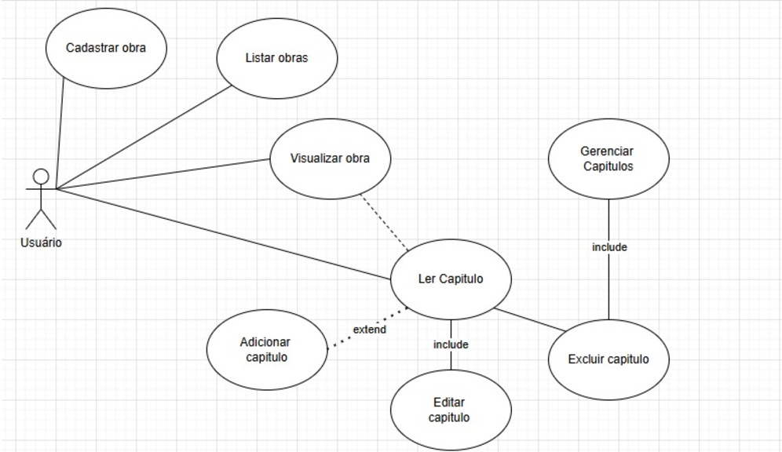

# Archivum-Fanfiction

**Arquivum** é uma plataforma para criação, leitura e gerenciamento de fanfics (obras literárias feitas por fãs), desenvolvida em **Java** com integração a **MySQL**.  
Inspirada no AO3 (*Archive of Our Own*), a aplicação permite que usuários publiquem suas obras, adicionem capítulos, usem tags e explorem fanfics de outros autores.

---

## 🧩 Sumário
1. [Autores](#autores)  
2. [Sobre o Projeto](#sobre-o-projeto)  
3. [Funcionalidades Principais](#funcionalidades-principais)  
4. [Modelagem do Banco de Dados](#modelagem-do-banco-de-dados)  
5. [Tecnologias Utilizadas](#tecnologias-utilizadas)  
6. [Como Executar o Projeto](#como-executar-o-projeto)  
7. [Estrutura de Pastas Sugerida](#estrutura-de-pastas-sugerida)  


## 👥 Autores

A equipe do **Arquivum** é composta por estudantes responsáveis por diferentes etapas do desenvolvimento e documentação do projeto.

| Nome              | Função / Papel                                           |
| ----------------- | -------------------------------------------------------- |
| **Maria Flor**    | Desenvolvimento **Java**  |
| **Lis Peixoto**   | Análise de requisitos e documentação **PRAXIS**;Desenvolvimento de interface, integração com banco de dados|
| **Pedro Marques** | Modelagem de dados , classes DAO |

---

## 🧠 Sobre o Projeto
O **Arquivum** é um sistema acadêmico desenvolvido no contexto da disciplina de *Programação Web / Java*, seguindo a metodologia **PRAXIS** do IFG - Campus Inhumas.

### 🎯 Objetivo
Desenvolver uma plataforma integrada para publicação, leitura e organização de fanfics, em versões **desktop (Java)** e **web (HTML, CSS, JS)**.

### 🧍 Público-alvo
Criadores e consumidores de literatura amadora e fanfics.

---

## ⚙️ Funcionalidades Principais

| Função | Descrição |
|--------|------------|
| 🧑‍💻 Cadastro de Usuário | Permite criar conta, autenticar e gerenciar perfil |
| 🖋️ Criação de Obras | Usuário pode cadastrar título, resumo, tags e publicar fanfics |
| 📜 Gerenciamento de Capítulos | Adicionar, editar, excluir e listar capítulos de uma obra |
| 📖 Leitura de Obras | Interface para leitura de capítulos, com navegação sequencial |
| 🏷️ Sistema de Tags | Organização e busca por gênero, fandom ou tema |
| 💾 Banco de Dados | Armazenamento das informações de usuários, obras e capítulos |

---

## 🗃️ Modelagem do Banco de Dados

### Diagrama Entidade-Relacionamento



### Script SQL
```sql
CREATE DATABASE fanficdb;
USE fanficdb;

CREATE TABLE usuarios (
    id_usuario INT AUTO_INCREMENT PRIMARY KEY,
    nome_usuario VARCHAR(100) NOT NULL,
    email VARCHAR(150) NOT NULL UNIQUE,
    senha VARCHAR(255) NOT NULL,
    data_criacao TIMESTAMP DEFAULT CURRENT_TIMESTAMP
);

CREATE TABLE obras (
    id_obra INT AUTO_INCREMENT PRIMARY KEY,
    titulo VARCHAR(200) NOT NULL,
    resumo TEXT,
    tags VARCHAR(255),
    id_autor INT NOT NULL,
    data_publicacao TIMESTAMP DEFAULT CURRENT_TIMESTAMP,
    FOREIGN KEY (id_autor) REFERENCES usuarios(id_usuario)
        ON DELETE CASCADE ON UPDATE CASCADE
);

CREATE TABLE capitulos (
    id_capitulo INT AUTO_INCREMENT PRIMARY KEY,
    titulo_capitulo VARCHAR(200) NOT NULL,
    conteudo TEXT NOT NULL,
    numero INT NOT NULL,
    id_obra INT NOT NULL,
    data_publicacao TIMESTAMP DEFAULT CURRENT_TIMESTAMP,
    FOREIGN KEY (id_obra) REFERENCES obras(id_obra)
        ON DELETE CASCADE ON UPDATE CASCADE
);


💻 Tecnologias Utilizadas

Java 22+

MySQL 8+

JDBC  Pattern

FXML / Scene Builder (para interface gráfica)

Git e GitHub (controle de versão)


